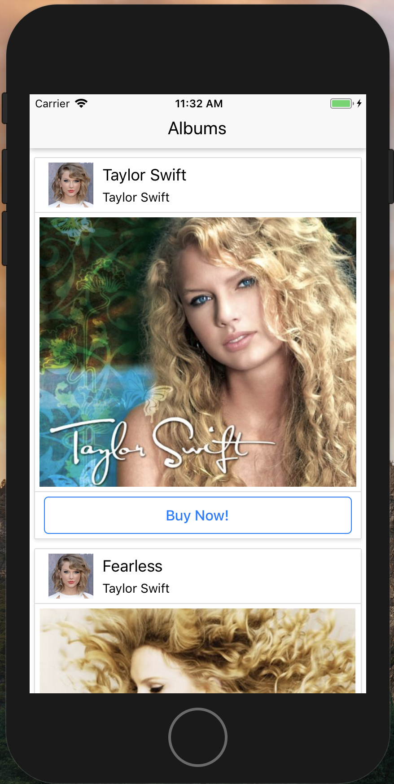
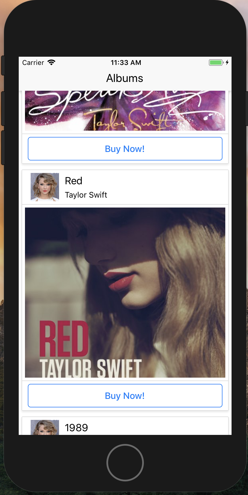
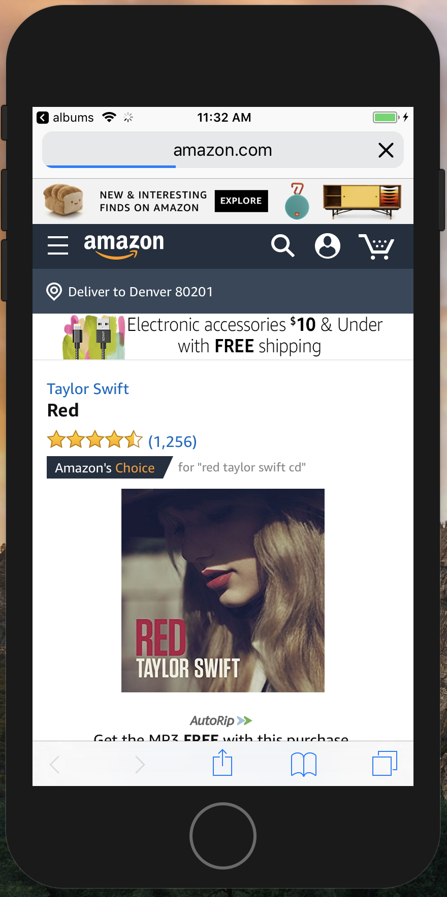

# Album_App-React-Native

# Purpose 

* I created this app to learn/practice React-Native

## App Functionality:

- Open app to see a list of CD's, pulled from an API source.
- CDs can be clicked and you are taken to the amazon link on your phone browser

### Screenshots:

- (after click of "Buy Now", takes you to Amazon Link)

